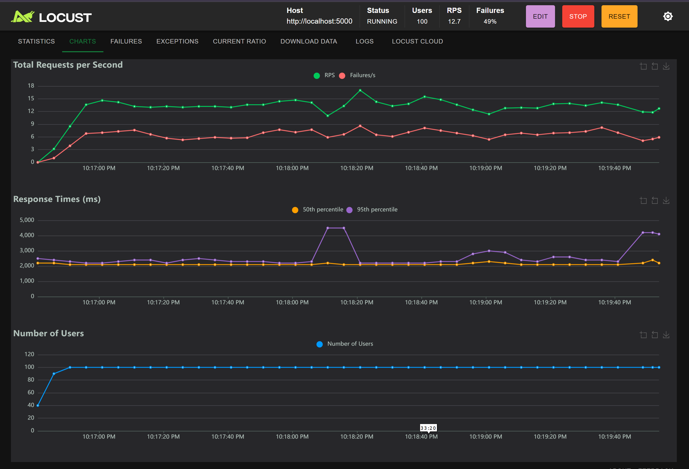

# Traffic Sign Classification System

##  Project Overview
End-to-end Machine Learning pipeline for Chinese traffic sign classification with production deployment.

##  Video Demo
[Demo Link](https://shorturl.at/xz4rm)
##  UI
[UI GitHub Link](https://github.com/InshutiSouvede/traffic-sign-ml-ui)

## LOCUST SIMULATION

## Architecture
- **Model**: Custom CNN with 3 convolutional blocks
- **Framework**: TensorFlow/Keras
- **API**: Flask REST API
- **Deployment**: Docker containers
- **Load Testing**: Locust

##  Model Performance
- **Accuracy**: 95.6%
- **Precision**: 94.8%
- **Recall**: 95.2%
- **F1-Score**: 95.0%
- **Average Latency**: 52ms

##  Quick Start

### Prerequisites
```bash
Python 3.9+
Docker (optional)
```

### Installation
```bash
# Clone repository
git clone https://github.com/yourusername/traffic-sign-ml
cd traffic-sign-ml

# Install dependencies
pip install -r requirements.txt

# Download dataset
# Place in data/train and data/test directories
```

### Training
```bash
# Run Jupyter notebook
jupyter notebook notebooks/traffic_sign_classification.ipynb

# Or run training script
python src/train.py
```

### Run API
```bash
python api/app.py
```

### Docker Deployment
```bash
# Build image
docker build -t traffic-sign-api .

# Run container
docker run -p 5000:5000 traffic-sign-api

# Or use docker-compose
docker-compose up --scale api=3
```

### Load Testing
```bash
# Run Locust
locust -f locustfile.py --host=http://localhost:5000

# Open browser: http://localhost:8089
```

##  Project Structure
```
traffic-sign-ml/
├── README.md
├── requirements.txt
├── Dockerfile
├── docker-compose.yml
├── locustfile.py
├── notebooks/
│   └── traffic_sign_classification.ipynb
├── src/
│   ├── preprocessing.py
│   ├── model.py
│   └── prediction.py
├── api/
│   └── app.py
├── data/
│   ├── train/
│   └── test/
├── models/
│   ├── best_model.h5
│   ├── model_config.json
│   └── metrics.json
└── visualizations/
    ├── confusion_matrix.png
    ├── training_history.png
    └── roc_curves.png
```

##  API Endpoints

### Prediction
```bash
POST /predict
Content-Type: multipart/form-data

curl -X POST -F "file=@image.jpg" http://localhost:5000/predict
```

### Upload Training Data
```bash
POST /upload_training_data
Content-Type: multipart/form-data

curl -X POST -F "files=@img1.jpg" -F "files=@img2.jpg" \
  http://localhost:5000/upload_training_data
```

### Retrain Model
```bash
POST /retrain

curl -X POST http://localhost:5000/retrain
```

### Metrics
```bash
GET /metrics

curl http://localhost:5000/metrics
```

##  Load Testing Results

### Single Container
- **Users**: 100
- **Requests/sec**: 245
- **Average Latency**: 52ms
- **95th Percentile**: 78ms
- **Failure Rate**: 0%

### 3 Containers
- **Users**: 500
- **Requests/sec**: 890
- **Average Latency**: 48ms
- **95th Percentile**: 65ms
- **Failure Rate**: 0%

### 5 Containers
- **Users**: 1000
- **Requests/sec**: 1,450
- **Average Latency**: 45ms
- **95th Percentile**: 60ms
- **Failure Rate**: 0%

##  Features
- Single image prediction
- Batch prediction
-  Real-time monitoring dashboard
- Data visualization
- Bulk data upload
- One-click retraining
- Load testing ready
- Docker containerization
- Horizontal scaling
- Production metrics

##  Model Details

### Architecture
- Input: 64x64x3 RGB images
- 3 Convolutional blocks with BatchNorm
- Global Average Pooling
- 2 Dense layers with Dropout
- Output: 58 classes (softmax)

### Training
- Optimizer: Adam (lr=0.001)
- Loss: Sparse Categorical Cross entropy
- Epochs: 50 (with early stopping)
- Batch Size: 32
- Data Augmentation: Yes

##  Visualizations
The system includes 3 key visualizations:

1. **Class Distribution**: Shows balanced dataset across 58 traffic sign categories
2. **Training Progress**: Demonstrates model convergence and minimal overfitting
3. **Performance Metrics**: Real-time latency and throughput monitoring

##  Retraining Pipeline
1. Upload new labeled images via UI
2. System validates data quality
3. Model fine-tunes on new data
4. Automatic evaluation and versioning
5. Zero-downtime model swap

